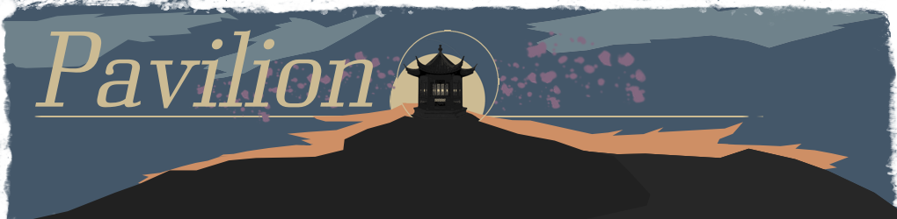
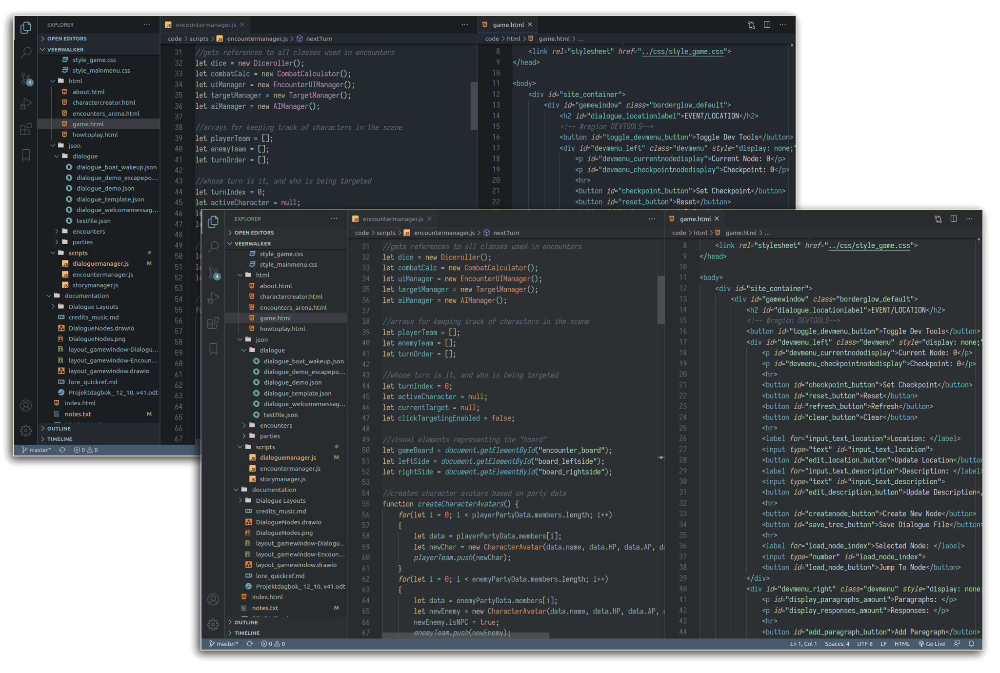

# README

</img>

## Pavilion
Pavilion is a mellow dark theme inspired by gold-trimmed pavilions, with washed-out blue and orange and bright "gold trims".

This extension contains the original Pavilion theme, and a darker "night" version with purple accents instead of orange.

The theme is currently tested for HTML, CSS, JavaScript, Java, Python and Markdown files, with more language support on the way. 

---

### Installation
- Open the **Extensions** sidebar in VS Code.
- Search for *"Pavilion Theme"*
- Click **Install**
- Open the Command Palette with **Ctrl+Shift+P** or **⇧⌘P.**
- Select **Preferences: Color Theme** from the drop-down menu.
- Select **Pavilion** or **Pavilion Night**
- Enjoy!

Alternatively, you can download/fork the project from GitHub, and place the pavilion-theme folder in **vscode/extensions**!

---

### Contribution
The repository can be found at: **https://github.com/JStameus/pavilion-theme**

Feel free to report issues, feedback and pull requests to help improve Pavilion with tweaks and additional language support. 

And of course, make sure to follow the code of conduct:

- Commit messages should be precise and descriptive
- Make sure to test your changes before making a pull request
- Feed the ducks with fruit and vegetables instead of bread  

---

### Planned Features:
**Language Support for:**
- C#
- PHP
- SQL
- Ruby

**Light version**

**Non-italic version**

---

### Personalization
The hex codes for the colors used in this theme can be found in the **colorcodes.md** file. 
